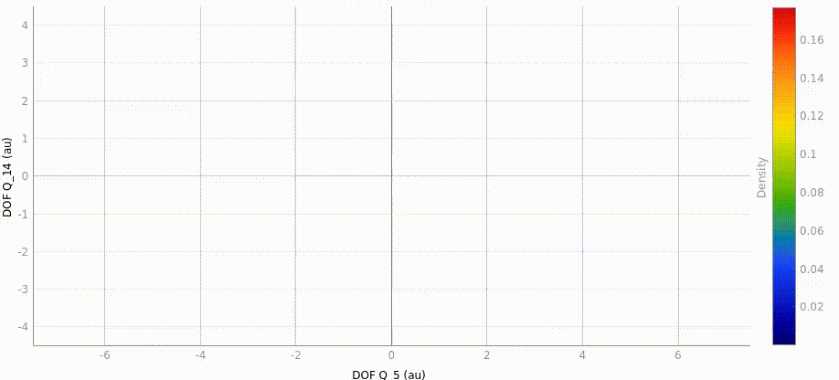

# `quantics-analysis-gui`

*2D density evolution up to 100 fs for the wavefunction in the butatriene cation in the X̃ (lower excited) state, showing bifurication from the à (upper excited) state at a conical intersection between the two states.* See also [***Faraday Discuss.***, **2004**, 127, 307-323](https://doi.org/10.1039/b314253a), Fig. 4.

This repository contains the code and report for my thesis project, *Creation of a Graphics User Interface for the Analysis of Quantum Dynamics Simulations*, as part of my degree in MSc Scientific and Data Intensive Computing. The goal of the project was to improve the pre-existing CLI analysis framework for the quantum dynamics simulation software with a new graphical user interface (GUI) using PyQT.

This project, while standalone, depends on [*Quantics*](https://www2.chem.ucl.ac.uk/quantics/), the software required to perform the simulation. **This repository does not contain Quantics.** However, the folder `demo/` contains example output files from the Quantics simulation and analysis which you can inspect by enabling *no command mode* in the Options menu of the GUI.

If you already have access to the Quantics repository, there should already be an existing (hopefully more up-to-date) version present in `source/analysis/`.

+ Code is stored in the `analysis_gui/` directory.
    + For information on installation, see the README in this directory, or read the documentation.
+ Documentation is stored in the `doc/` directory. The HTML file can be opened with a web browser.
+ The report and presentation are stored in the `report/` directory.
    + In order to compile `report.tex`, a LuaLaTeX or XeTeX engine is required as it depends on `unicode-math`.
    + `presentation.pptx` contains CMU Serif and CMU Sans-serif fonts ([Download link](https://cm-unicode.sourceforge.io/download.html)). Without these, the presentation may look strange.